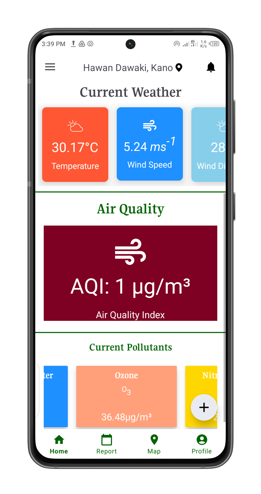

<h1 style='text-align:center'> Environmental Monitoring and Reporting System </h1>
<p style="text-align: justify">EMRS is an Android-based Environmental Monitoring and Reporting System 
focused on transforming environmental data access, reporting, and awareness. The 
system will empower users to monitor a wide range of environmental parameters such as 
temperature, humidity, air quality (including pollutants like PM2.5, PM10, CO, SO2, NO2), wind 
speed, and wind direction. Users can report incidents related to excess emissions, spills, water 
quality issues, waste management concerns, pollution sources, weather impacts, and other 
environmental observations. By leveraging Android Studio as the development environment, Java 
as the primary programming language, XML for designing user interfaces, Firebase for real-time 
database functionalities, Google Cloud for scalable and reliable cloud services, and NoSQL 
(Firebase Realtime Database) for efficient data storage and retrieval, this project ensures a robust 
and dynamic platform for environmental data collection, analysis, and reporting within the 
Environmental Monitoring and Reporting System (EMRS).</p>

## Screenshots

### Home Screens
| Home Screen 1 |   →   | Home Screen 2 |
|:-------------:|:-----:|:-------------:|
|  | |  |


### Report Templates
| Report Template 1 |   →   | Report Template 2 |
|:-----------------:|:-----:|:-----------------:|
|  | |  |

### Login Screen


### Hero Screens
| Hero Screen 1 |   →   | Hero Screen 2 |
|:-------------:|:-----:|:-------------:|
|  | |  |

### Report History


### Profile Screen


### Admin Screen


## Features
- Monitor environmental parameters like temperature, humidity, air quality, wind speed, etc.
- Real-time data reporting and storage using Firebase.
- User-friendly interface designed with XML.
- Incident reporting for various environmental issues.
- Authentication with Google, Facebook, email, and password.
- Google Maps integration for location-based environmental monitoring and reporting.


## Technology Stack
- **Android Studio:** Development environment
- **Java:** Primary programming language
- **XML:** UI design
- **Firebase:** Real-time database functionalities
- **NoSQL (Firebase Realtime Database):** Efficient data storage and retrieval

## How to Use
1. Clone the repository.
   ```bash
   git clone https://github.com/Muhammad0isah/EMRS.git

